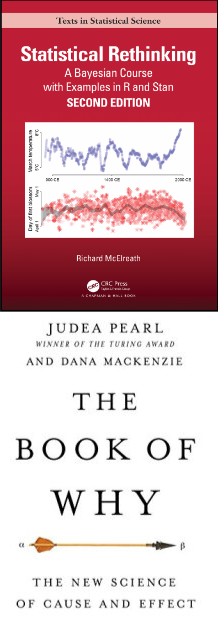
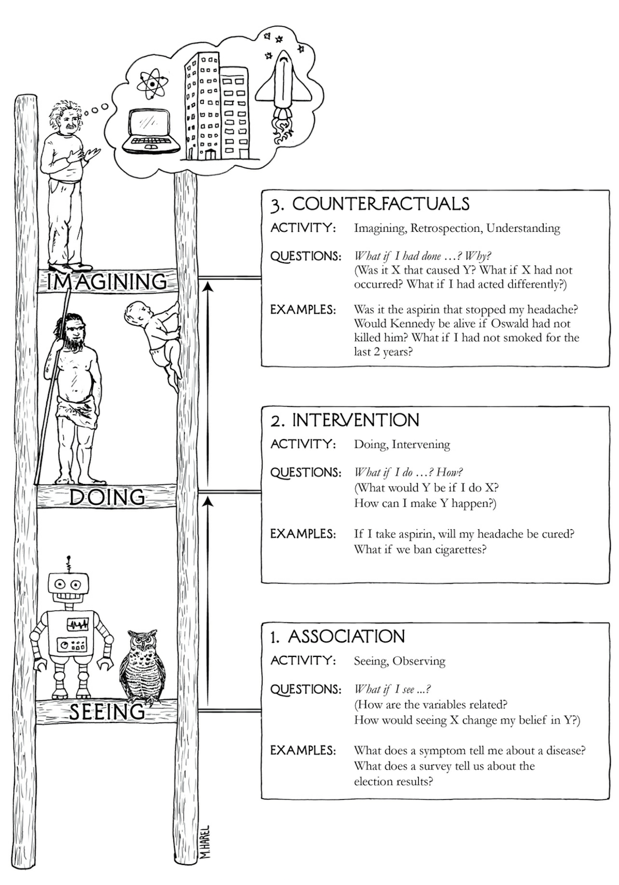
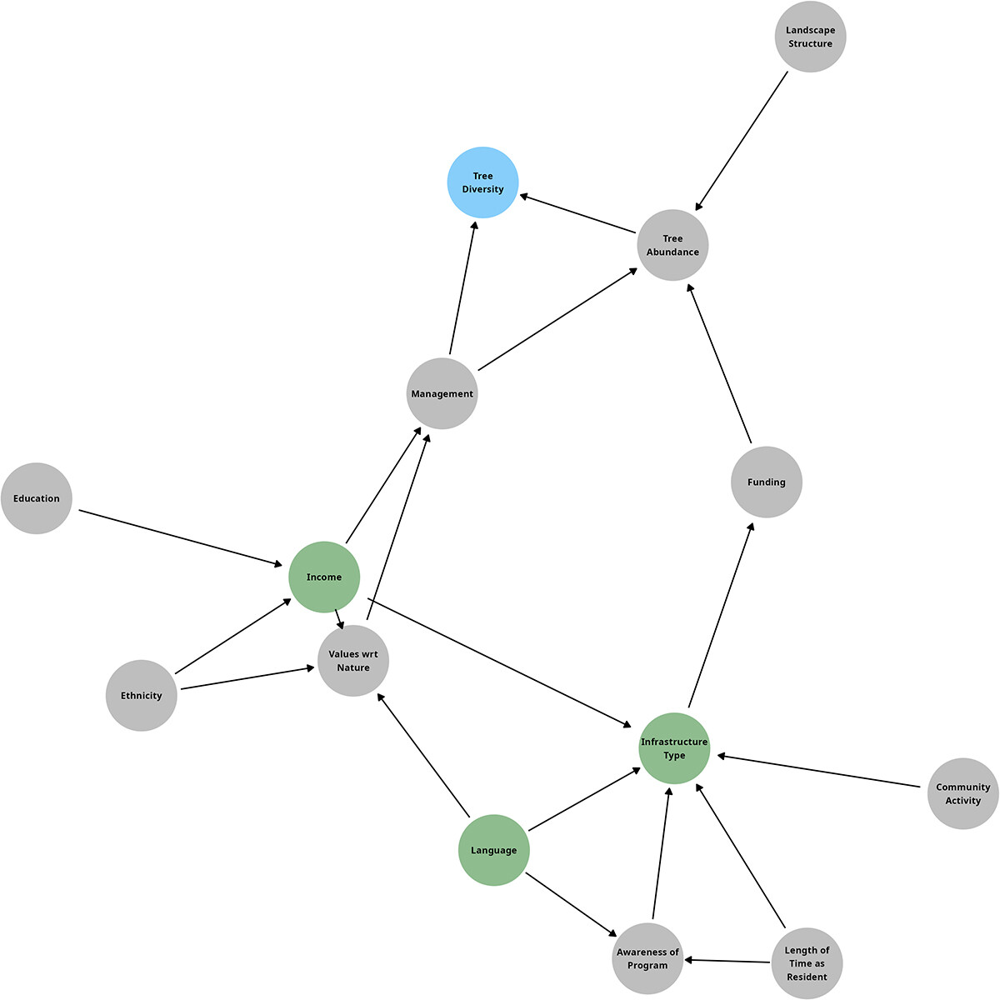
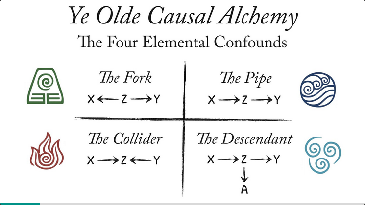

## This workshop is plagiarism!!

::::: columns
::: {.column width="80%"}
-   almost all of this content comes from Statistical Rethinking, a textbook and online course that is completely free and available by Richard McElreath
-   a good portion also comes from The Book of Why and other works by Judea Pearl
-   there are many scholars, ecologists and otherwise who use this method and explain it better than I ever will - resources at the end
:::

::: {.column width="20%"}
{fig-align="center" height="150%"}
:::
:::::

## Let's not panic {background-image="presentation_imgs/stop.jpg"}

::::: columns
:::: {.column width="90%"}
::: {style="background-color: #000000; opacity: 90%"}
-   the beauty of causal inference is that it relies on concepts that come very naturally to the human brain and is founded on using the expert scientific knowledge that every scientist brings to their studies

-   THIS DOES NOT CHANGE EVERYTHING - just gives you a framework to easily express what you already feel and know
:::
::::
:::::

## Why don't we talk / learn about causation?

-   Pearson & Galton, founders of modern statistics, failed in creating the tools needed for causal inference and subsequently decided that it was impossible and "unscientific"

    -   they used their enormous influence to teach generations of scientists this and attack anyone who opposed them

-   Judea Pearl invented the math required to answer causal questions only \~ 40 years ago! Science is slow!

-   causation is not controversial - we are just transitioning

## What is causal inference? {.scrollable}

::::: columns
::: {.column width="50%"}
-   the study of causes and effects: association, intervention, and counterfactuals
-   hypothesis testing
-   effect sizes, direction of effects, comparisons between groups, probability distributions, interventions, etc.
-   agnostic of statistical approach (i.e., Bayesian or frequentist)
:::

::: {.column width="50%"}
{width="75%"}
:::
:::::

## What is causal inference NOT?{.scrollable}

-   <t style = "color: #f44336"> **prediction!! forecasting!!** </t>

-   if we want to use our models to estimate data in places or times that we do not have data for, but we DO NOT CARE about the relationships between the things in our model, that is prediction and not causal inference

-   prediction is cool!! it is separate from (and mathematically at odds with) causal inference

-   AIC is a tool for measuring the predictive power of your model - it is not appropriate for causal inference

-   **NOTE:** causation vs prediction is a difference in approach and philosophy, but there is overlap in tools (e.g., you may use a "predict" function in R to generate a causal effect size)

## A causal workflow

1.  Read the literature, develop hypotheses and understanding of the system

2.  Develop research question(s) of interest

3.  Build a DAG** representing the system (step repeated many times after discussions with collaborators, co-authors, etc)

4.  Identify data required to answer questions of interest

5.  Collect data

6.  Build statistical models to test question

7.  Report DAG + results

## DAGs : a tool for causal inference {.smaller}

::::: columns
::: {.column width="40%"}
-   "directed acyclic graph" - relationships go in one direction

-   arrows indicate a causal relationship from one variable to another

-   use your expert knowledge + literature to outline your system with your hypotheses and assumptions (you already make assumptions now, you just don't visualize them!)

-   decide what variables you need in your statistical test (e.g., model) using your DAG
:::

::: {.column width="60%"}

:::
:::::

## Why do DAGs matter?

-   <t style = "color: #f44336">**putting everything in your model does not test the relationship(s) you are interested in**</t>

::::: columns
::: {.column width="40%"}
-   complex systems have *confounders* that mislead us and that we need to adjust for
-   adjustments are dependent on our DAG and the variable of interest
:::

::: {.column width="60%"}

:::
:::::

## Example: question of interest

## Example: building the DAG

## Example: identifying the adjustment set

## Example: building a model

## Example: asking another question

## Example: asking another another question

## Table 2 fallacy

-   each variable has its own set of adjustments it needs in order to test its effects
-   therefore, **not all coefficients in a summary table are causal relationships**
    -   check your DAG!
-   this is described as the "Table 2 Fallacy" - we can only interpret the effect(s) that we have adjusted for, not (necessarily) everything in our summary table
-   [The table 2 fallacy: presenting and interpreting confounder and modifier coefficients](https://pubmed.ncbi.nlm.nih.gov/23371353/)

## Some DAG notes / a petit sermon {.smaller}

1.  variables that do not have shared causes in your system do not need to be included - your DAG does not need to include every variable in the world

2.  do NOT exclude variables just because you haven't measured them, these are still potential confounders and need to be part of your DAG!

3.  Metrics =/= causes, use the process/mechanism and not the metric that you measure (e.g., veg abundance causes a difference in temperature, not NDVI)

4.  you are an expert with good intuition and expertise, don't be scared to put your assumptions down on paper

5.  presenting the assumptions you are making about your system is good, transparent science and allows the development of the field

    -   !! you are doing this anyways !! when you decide what variables to collect / what to include in your models, you are just being less transparent about it! we must always do our best and be brave!

## Let's build (& share) our own DAGs

[dagitty](https://dagitty.net/dags.html)

-   10 mins to build a DAG for your system
-   someone (or multiple people) shares their DAG
    -   we go through it
    -   we adjust the DAG to answer a research question

## Resources {.scrollable}

-   [Statistical Rethinking](https://github.com/rmcelreath/stat_rethinking_2024)
-   [Judea Pearl](https://bayes.cs.ucla.edu/home.htm)
-   [Causal Inference in R](https://www.r-causal.org/)
-   [ggdag: Intro to DAGs](https://r-causal.github.io/ggdag/articles/intro-to-dags.html)
-   [Andrew Heiss: do-calculus and backdoor paths](https://www.andrewheiss.com/blog/2021/09/07/do-calculus-backdoors/)
-   [Addicot et al 2022. Toward an improved understanding of causation in the ecological sciences.](https://doi.org/10.1002/fee.2530)
-   [Stewart et al 2023. Model selection in occupancy models: Inference versus prediction](https://esajournals.onlinelibrary.wiley.com/doi/10.1002/ecy.3942)
-   [Tredennick et al 2021. A practical guide to selecting models for exploration, inference, and prediction in ecology](https://esajournals.onlinelibrary.wiley.com/doi/10.1002/ecy.3336)
-   [Laubach et al. 2021. A biologist's guide to model selection and causal inference](https://royalsocietypublishing.org/doi/10.1098/rspb.2020.2815)
